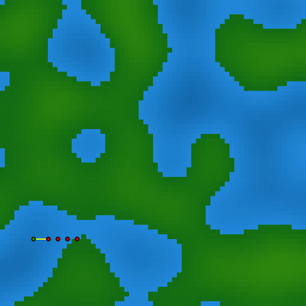
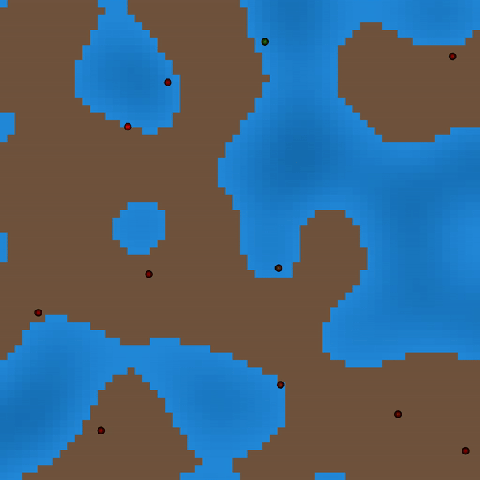
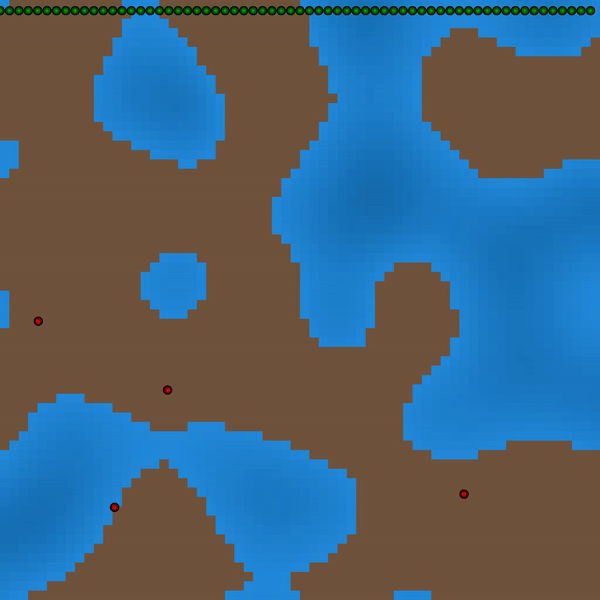

# JaxLife

## What is JaxLife
JaxLife is an artificial life simulator that focuses on evolving high-level behaviours. This is done by having agents interact with Turing-complete robot systems.


### Simulation
Our simulation consists of *agents*, *robots* and *terrain*. Agents evolve via natural selection, and are parametrised by a recurrent neural network. Robots can be programmed by agents, and are able to perform Turing-complete computation.
Finally, terrain controls many aspects of the simulation, such as how easy it is to move, how much energy there is available, etc. Terrain also changes slowly due to a weather and climate-like system.
<p align="center">
    
</p>

### Agents
The agent's architecture uses separate encoders for all nearby entities. These are processes using self attention, and then cross attention with the agent's own embedding. The terrain is processed by a different encoder, and concatenated with the final entity representation. All of this is passed through an LSTM.
<p align="center">
    
</p>

### Robots
Robots  have the same action space as agents and can be programmed by sending a message to them. These robots can theoretically perform Turing-complete computation
<p align="center">
    
</p>

But they are also able to perform useful tasks, such as transportation, farming and communication.

<p align="center">
    
    
    
</p>

## Usage

### Installation

```bash
pip install -r requirements.txt
pre-commit install
```

### Running
You can run the following to start a simulation. There are many different configuration options, see the file for more details. A few important parameters are:
- `--gui`: Run interactively using Pygame
- `--wandb`: Whether or not to log to Weights and Biases.
- `--num-agents`: How many agents are in the simulation.
```bash
python src/main.py
```


## See Also

- [Alien](https://github.com/chrxh/alien): A CUDA-powered Alife simulation.